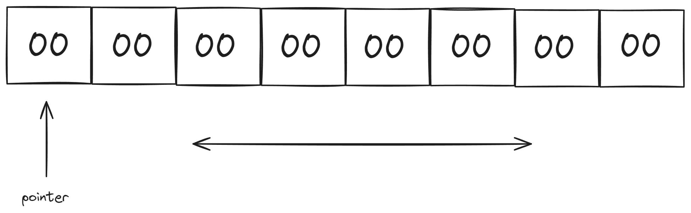

# Olang

My own basic programming language is called Olang. It is inspired by the Brainfuck language.

This is the initial state.



In each cell, we can store 1 byte (a number in hexadecimal with 2 digits), ranging from 00 to FF.

## How to compile?

```bash
$ gcc -o olang main.c
```

## How to use?

### Instruction

Olang has differents instructions:

- **`INC`**: Increases by one the value at the pointer.
- **`DEC`**: Decreases by one the value at the pointer.
- **`SET`** &lt;hex&gt;: Sets the value of &lt;hex&gt; to the pointer.
- **`MOF`**: Moves the pointer forward.
- **`MOB`**: Moves the pointer backward.
- **`PRT`**: Prints the value at the pointer as an ASCII character.

### Using olang

First, you need to compile the C program using `gcc` or an alternative compiler.

Then, you can use it interactively by running the following comamnd:

```bash
$ ./olang
```

You can also use it like interpreter. First, write some file (e.g., example.ol) then run the following command:

```bash
$ ./olang example.ol
```

### Writing files

Olang file is a simple text file with extension `.ol`.

Rules:

1. Every instruction must be in a different line.
2. The file must end with empty line.
3. All instruction must be writen in uppercase.

**Example**

```olang
SET 48
PRT
```

**Output**

```bash
H
```

## Related to

[Maquina de turing](https://es.wikipedia.org/wiki/M%C3%A1quina_de_Turing)

[Brainfuck programming language](https://es.wikipedia.org/wiki/Brainfuck)

## License

[MIT](https://choosealicense.com/licenses/mit/)
